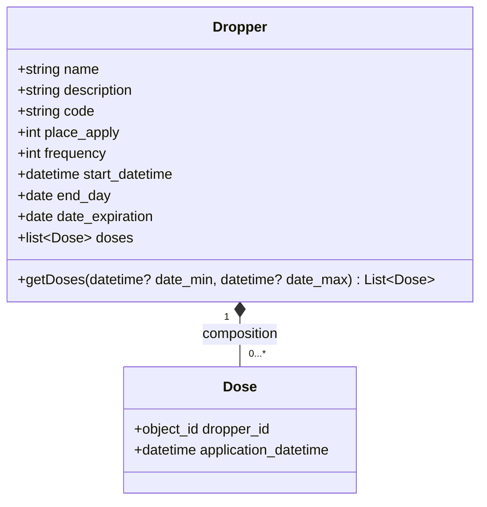
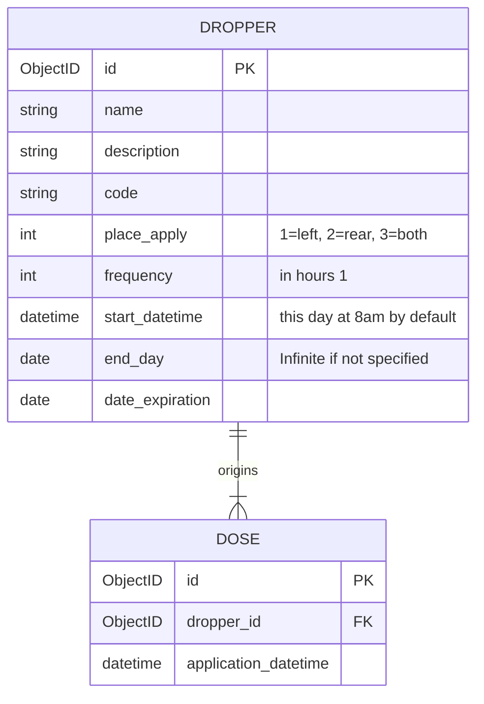

# Drops Manager API 💧
---
# Alcances

Plataforma de administración de gotas para los ojos que permite a los usuarios llevar un registro de sus dosis diarias, recordatorios de horarios y seguimiento de la cantidad de gotas utilizadas. Simplifica la gestión de tratamientos oftalmológicos y ayuda a garantizar una aplicación adecuada y regular de las gotas, mejorando así la salud ocular de los usuarios.

# Recursos

-  Python
-  FastAPI
-  MongoDB

## Ver Online:

- Documentación API con Swagger: https://dropsmanager-1-z2490798.deta.app/docs
- Documentación API con Redocly: https://dropsmanager-1-z2490798.deta.app/redoc

# Pantallas y especificaciones

## 1\. Home (day_timetable)

Calendar en vista semanal con el día de hoy seleccionado por defecto. Con una lista de los events del día seleccionado.
La vista del calendario es semanal por lo que el cálculo de eventos se hace sobre la semana solicitada, de domingo a sábado. *El usuario deberá contemplar si hay gotas que tienen frecuencias particulares par corregir el día de comienzo para cada semana (p.ej: si una gota se coloca día de por medio dependiendo cada semana cambiarán la cantidad de días de aplicación, algunas semanas se colocarán 4 días y otras 3)*

## 2\. Detalle de Event seleccionado (hour_timetable).

- Un **event** se componen de una lista de doses en un mismo horario de un determinado día. Event: \[Doses\], daytime.
    Es el resultado de una query que filtra y agrupa dosis por fecha y horario.
- Una **dosis** es una aplicación de un determinado medicamento a una determinada hora en un determinado día. Dosis: Dropper, daytime.

> 💡 Probar si se puede calcular de forma sencilla las dosis a medida que se consulta una determinada semana. La regla sería en modo lazy load, primero que si se modifica algún dato relevante del un dropper, se borran las dosis existentes del mismo en el rango de la fecha de inicio en adelante y se generan las nuevas para la semana actual (si la fecha de inicio la afecta). Las demás se generan cuando se consulta una semana específica, el backend comprueba si para la semana solicitada ya existe la muestra, de lo contrario la calcula y crea las dosis correspondientes.
> En una versión más pro, podría comprobarse si la operación borrará dosis y pedirle validación al usuario.

## 3\. Detalle de dropper o pastilla con ABM.
- La propiedad start_datetime se compone de dos partes, el día de comienzo de aplicación de las dosis y la hora. La hora de inicio y la frecuencia es la que se utilizará para la creación diaria de las dosis.
- Se asume que las dosis comienzan a las 8am de cada día, se puede cambiar.
- La frecuencia es en horas.
    Cuando se carga o modifica la frecuencia u hora de inicio de algún dropper, se deben volver a regenerar los events.

## Dosis
El horario en las dosis se computará sin considerar el encadenamiento de dosificaciones, eso lo deberá contemplar el usuario. Por ejemplo si necesita esperar 5 minutos entre la aplicación de diferentes gota de un mismo horario para un mismo ojo. La aplicación plasmará el horario teórico para facilitar el agrupamiento en eventos de cada día.
```math

```

# Class Diagram


Atributos modificados: place_apply, frequency, start_datetime, end_day, [doses]
# Formato del json que devolverá el API:

## Droppers

```json
[
  {
    "id":"6417b00c36a1f48e085739f6",
    "name":"Clorhexidina",
    "description":null,
    "code":"2904282",
    "place_apply": 1,
    "frequency": 6,
    "start_datetime": "2023-01-17 08:00:00",
    "end_day": "2023-06-17",
    "date_expiration":"2023-05-07"
  }
]
```

## Doses
```json
[
  {
    "id":"64206d35bfcdec8f747d86e0",
    "dropper_id":"6417e646f1a687ad69c5ac7d",
    "application_datetime":"2023-05-07 08:00:00"
  }
]
```

# ER Diagram



# Dev

- Iniciar MongoDB:

`brew services start mongodb-community`

- Detener MongoDB:

`brew services stop mongodb-community`

- Crear entorno virtual:

`python3 -m venv <path_virtual_env>`

- Activar el entorno virtual:

`source <path_virtual_env>/bin/activate`

- Desactivar el entorno virtual:

`deactivate`

Iniciar el server de desarrollo:

`uvicorn main:app --reload`

Detener el server:

`Ctrl+C`

- Modo DEV - Documentación API con Swagger: http://127.0.0.1:8000/docs
- Modo DEV - Documentación API con Redocly: http://127.0.0.1:8000/redoc